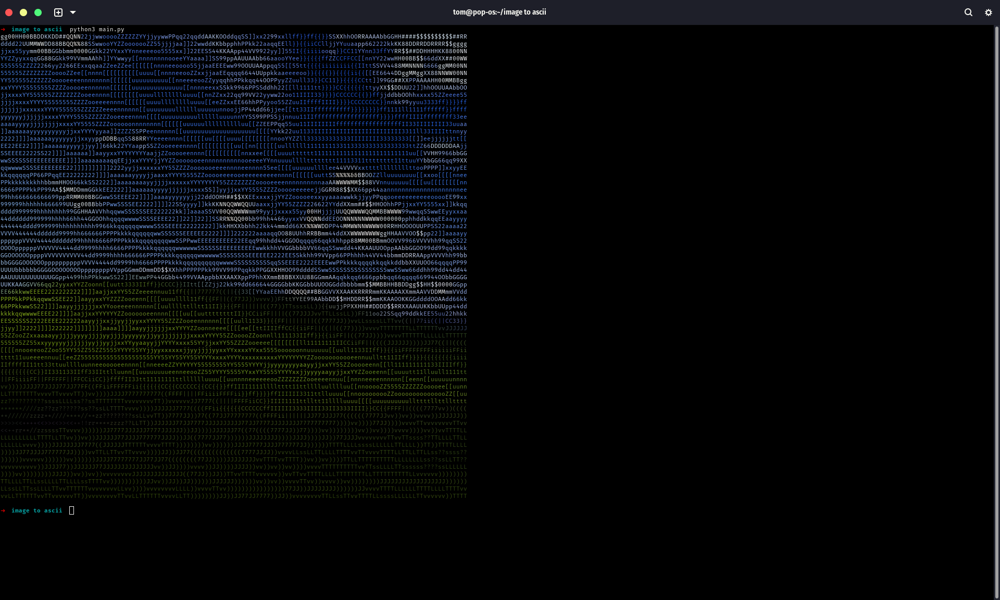

# Image to ASCII Converter
A simple utility that converts an image file into colored text and prints to the terminal. 
1. Customize output by changing the `width`, `height`, and `input_path` variables in `main.py`
2. Open the project directory in a terminal
3. Run the script with `python3 main.py`

